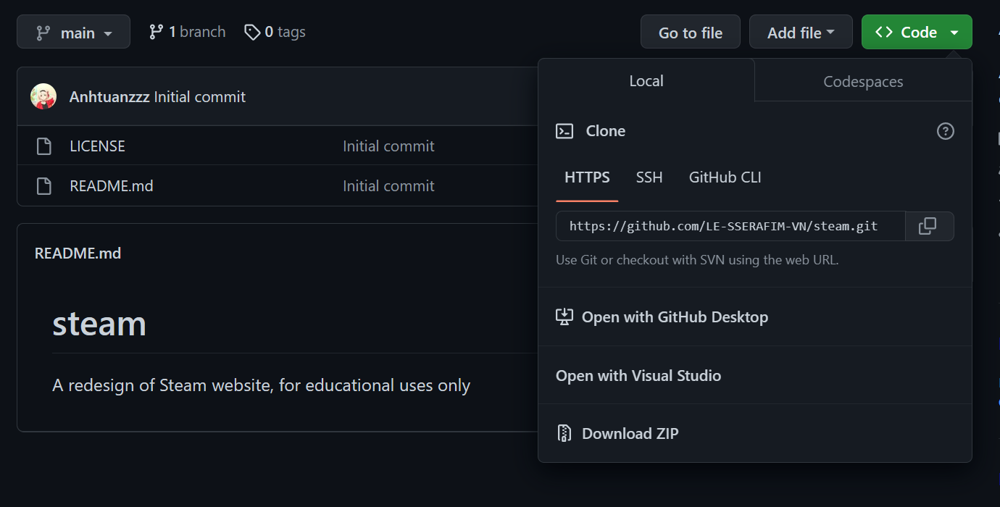
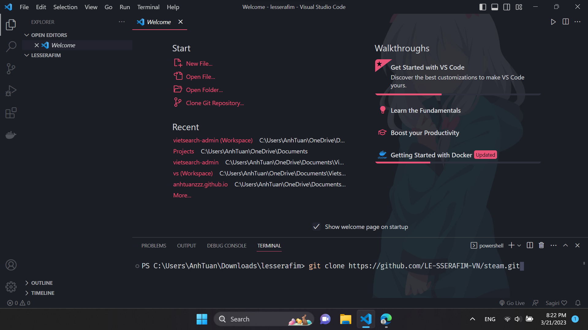
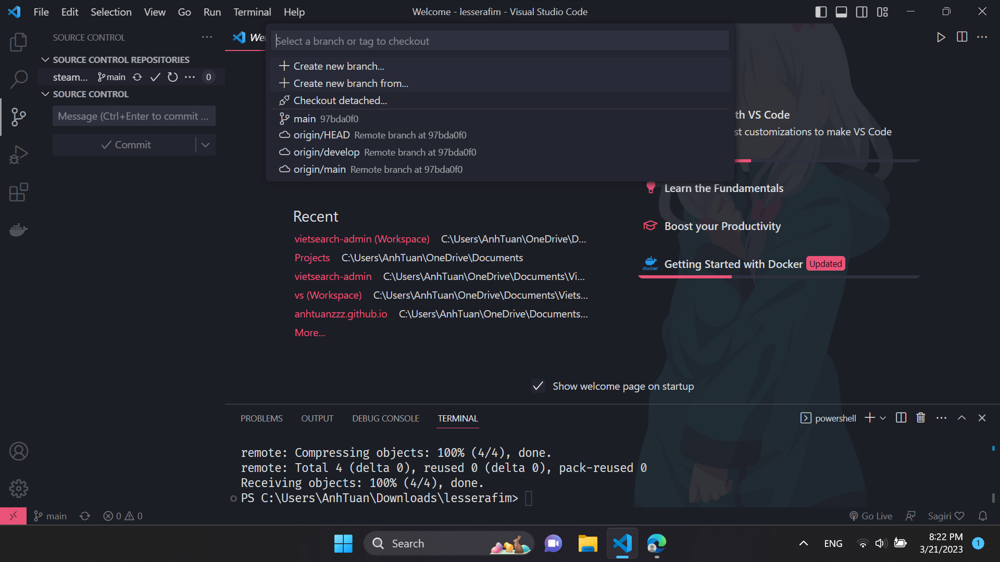
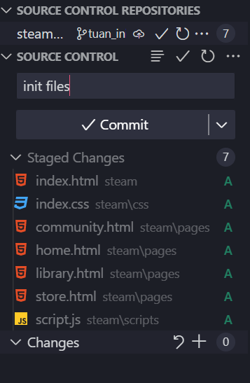
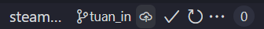

# tutorial

### Dùng git clone từ github về

### ### lệnh ```git clone``` + link vừa copy

### Tạo branch mới, đặt tên dễ hiểu

### Sau khi code xong stage các thay đổi và commit

### Nếu mới tạo branch thì publish branch

### Lên github vào Pull Request, tạo PR từ branch vừa commit vào /develop
